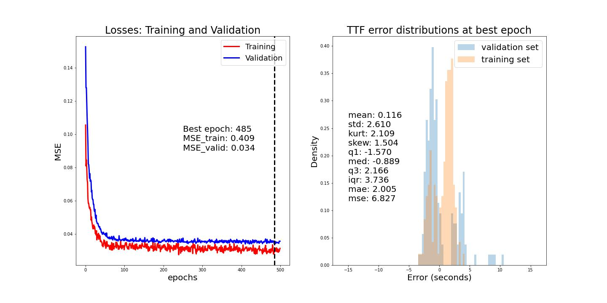

# Earthquake prediction project

This is a Deep Learning Class Project carried at ESPCI under the supervision of Professor Alexandre Allauzen.

Team members: Matthieu Dagommer, Paul Boulgakoff, Godefroy Bichon, Germain L'Hostis.

## Description

We propose two solutions to the deep learning challenge "LANL earthquake prediction". 
See more information on the webpage : https://www.kaggle.com/c/LANL-Earthquake-Prediction.
If you are comfortable with French language, feel free to read our report !

## Launch in Kaggle

You can directly access the notebooks in Kaggle via these two links: 
CNN 1D: https://www.kaggle.com/code/matthieudagommer/earthquake-prediction-cnn1d.
LSTM: https://www.kaggle.com/code/matthieudagommer/earthquake-prediction-lstm.

You can also run the code locally by cloning this repository, either the notebook or the modular Python version. 

## Retrieve the code

To download the repo via git, type:

    git clone https://github.com/MatDagommer/earthquake-prediction.git
  
Check that you are able to launch python from your Git Bash shell. 

    python --version

If that's not the case, this blog explains how to set it up : https://prishitakapoor2.medium.com/configuring-git-bash-to-run-python-for-windows-a624aa4ae2c5.
Check that you are using a virtual environment with the following versions:

Python : 3.10.4
Torch : 1.11

## Retrieve the data

To retrieve the data, go to https://www.kaggle.com/competitions/LANL-Earthquake-Prediction/data and click "Download".
You will have to unzip the content in the same folder as the scripts of this project.

## Train a new model (with the .py files)

In the Git Bash, you can run the program with default parameters with the following command. 
You need to choose a model: 0 stands for 1D CNN and 1 for LSTM.

    python main.py -model 0
    
There are several parameters you can play with to customize the training. You can get the list of these arguments by typing:

    python main.py --help
    
For instance, if you want to train a 1D CNN with 1000 epochs, a batch size of 300 and a learning rate of 0.001, you can type:
    
    python main.py -model 0 -ep 1000 -bs 300 -lr 0.0001
    
## Output

The program will eventually ask you to name the model you have just trained so it can save its features in Models/<model_name>.
A Matplotlib window should pop up with both the learning curve of your training and the distribution of error from the validation set at the best epoch.

